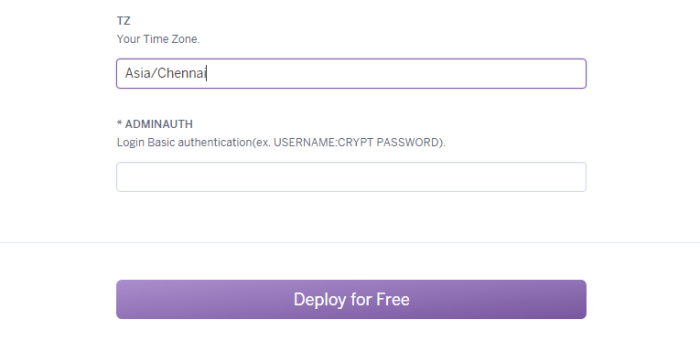
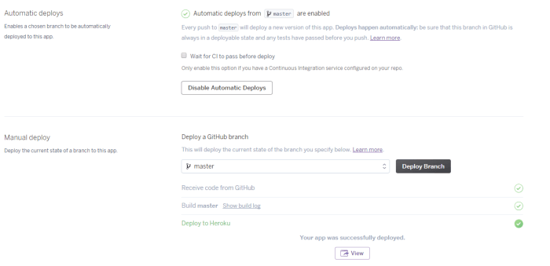

# WordPress 4.5.3-ja + pg4wp2 Heroku ([Original Repository](https://github.com/macminiosx/wordpress-ja-pg4wp2-heroku))

[](https://gitter.im/fossasia/loklak_wp_plugins?utm_source=badge&utm_medium=badge&utm_campaign=pr-badge&utm_content=badge)

This is a Wordpress site repo which can be deployed on Heroku to test the plugins with Loklak support. 

https://loklak-wordpress.herokuapp.com is a sample Wordpress installation with all plugins present in `wp-content/plugins`

## Installation

###Deploy from Github directly:

1. Click on 'Deploy to Heroku' to install a wordpress instance on Heroku.
  
  <p align="center">
    <a href="https://heroku.com/deploy?template=https://github.com/macminiosx/wordpress-ja-pg4wp2-heroku/tree/master">
      
    </a>
  </p>

2. Give your website a name and input your time-zone and add authentication information for .htpasswd to access wp-admin page (admin privileges). See the screenshot below. 

  <p align="center">
    
  </p>


3. Click on Deploy for Free. Once the app is deployed, Click on ‘Manage App’. Go to ‘Deploy’ tab and choose ‘Deployment method’ as Github

4. Connect your forked loklak_wordpress_plugins repo to Heroku. 

  <p align="center">
    
  </p>

5. To automate the deployment process when the github repo is updated, enable automatic deploys. Now deploy the master branch of your repo and you are good to go.

  <p align="center">
    
  </p>

### Clone github repository and deploy using Wordpress-Heroku toolbelt
To deploy using Heroku toolbelt, please refer to [Heroku-toolbelt installation doc](./docs/INSTALLATION_heroku_toolbelt.md)

For detailed information, refer to [this](http://blog.loklak.net/using-heroku-wordpress-buildpack-to-test-loklak-integration-in-wordpress-plugins/) blog. 

## Usage

Because a file cannot be written to Heroku's file system, updating and installing plugins or themes should be done locally and then pushed to Heroku.

## Updating

Refer to [Wordpress updation doc](./docs/UPDATE_wordpress.md)

## Deployment optimisation

If you have files that you want tracked in your repo, but do not need deploying (for example, *.md, *.pdf, *.zip). Then add path or linux file match to the `.slugignore` file & these will not be deployed.

Examples:
```
path/to/ignore/
bin/
*.md
*.pdf
*.zip
```

