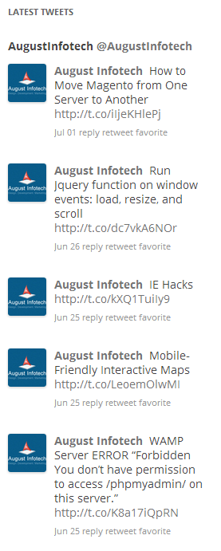
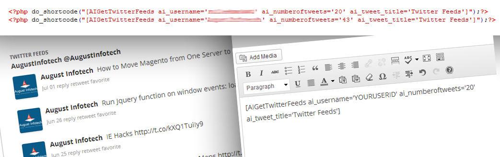

=== AI Twitter Feeds (Twitter widget & shortcode) ===

Contributors: augustinfotech
Tags: Twitter, Twitter API, Twitter 1.1, Twitter authentication, Feed, Twitter Shortcode, Twitter tweet, tweets, twitter, widget, twitter connect, twitter follow, twitter follow button, twitter share, twitter share button,Dashboard Twitter
Requires at least: 3.2
Tested up to: 4.2.4
Stable tag: 2.3
License: GPLv2 or later
License URI: http://www.gnu.org/licenses/gpl-2.0.html

As per twitter API 1.1 developer display requirements policy new version is updated. PLEASE DO NOT USE OLDER VERSIONS. 

== Description ==

**Features:** As traditional version of twitter API is no longer working now, this plugin provides facility to display twitter tweets on your website using Twitter 1.1 API with authentication.

**PLEASE DO NOT USE OLDER VERSIONS.
All older version do not meet requirements at below link policy hence removed. We will not provide support for older versions (1.0, 1.1, 1.2 & 1.3).**

**
Visit website:** [For Developer Display Requirements Policy] https://dev.twitter.com/terms/display-requirements. Embed timelines using only username or Hashtags/keywords.

* Using Twitter 1.1 API with authentication in Admin.
* No JavaScript embedded.
* You can manage tweets limits, twitter profile image,date, retweet link, reply link, favourite link and username from admin panel.
* Admin side display tweets in Dashboard.
* Admin side Manage Show "Follow @username" links.
* Multiple times you can use Twitter widget & shortcode.
* NEW Developed as per Twitter API 1.1 developer display requirements policy.Plugin Develop by August Infotech [Visit website](http://www.augustinfotech.com)

== Installation ==

**Important:** To use this plugin, please follow the steps given below:

1) Register at https://dev.twitter.com/apps/new and create a new app.

2) After registering, fill in App name, e.g. "_domain name_ App", description, e.g "My Twitter App", and write the address of your website. Check "I agree" next to their terms of service and click "create your Twitter application".

3) After this, your app will be created. Click "Create my access token" and you should see at the bottom "Access token" and "Access token secret". Refresh the page if you don't see them.

4) Copy "Consumer Key", "Consumer Secret", "Access Token" and "Access Token Secret" to admin panel, Menu ->'Settings' -> 'AI Twitter Settings'.

**Follow below steps to install plugin:**

1. Download plugin and place 'AI-Twitter-Feeds' folder to the '/wp-content/plugins/' directory or Install plugin directly from your wordpress admin, Menu-> Plugins -> Add New, and search for 'AI-Twitter-Feeds'zip and Install.
2. Activate the plugin through the WordPress admin panel,'Plugins' menu -> Installed Plugins -> find the 'AI Twitter Feeds' -> Activate.
3. Set Options for Twitter feeds from the admin panel menu link,'Settings -> AI Twitter Settings'.
4. Place PHP code `< ? php echo do_shortcode("[AIGetTwitterFeeds ai_username='Your Twitter Name(Without the "@" symbol)' ai_numberoftweets='Number Of Tweets' ai_tweet_title='Your Title']"); ? >` to display twitter feeds in your page template.
5. Place shortcode `[AIGetTwitterFeeds ai_username='Your Twitter Name(Without the "@" symbol)' ai_numberoftweets='Number Of Tweets' ai_tweet_title='Your Title']` to display twitter feeds in your post(s).
6. Use the widget to place it in your sidebar or other areas!

== Frequently Asked Questions ==

**No Questions**

== Screenshots ==

1. Widget Setting example in admin.

	

2. Widget view on front side.

	

3. Use Shortcode OR PHP code in Post/Template.

	

4. Settings Screen from WordPress Admin.

	

5. WordPress Admin Tweets Display In Dashboard.

	

== Changelog ==

= 1.0 =
* Removed version due to twitter API developer display requirements policy.

= 1.1 =
* Removed version due to twitter API developer display requirements policy. 
 

= 1.2 =
* Removed version due to twitter API developer display requirements policy.  

= 1.3 =
* Removed version due to twitter API developer display requirements policy.  

= 2.0 =
* Removed older versions due to twitter API developer display requirements policy.
* New version cover all features as older versions, but as per twitter API developer display requirements policy.

= 2.1 =
* Resolved script issue and design issue.

= 2.2 =
* Add custom css option and display error messages.

= 2.3 =
* Resolve retweet link issue.

== Upgrade Notice ==

**New version cover all features as older versions, but as per twitter API developer display requirements policy.**

**PLEASE DO NOT USE OLDER VERSIONS.**

1. All older version do not meet requirements at below link policy hence removed. We will not provide support for older versions (1.0, 1.1, 1.2 & 1.3).

2. Visit website : [For Developer Display Requirements Policy] https://dev.twitter.com/terms/display-requirements