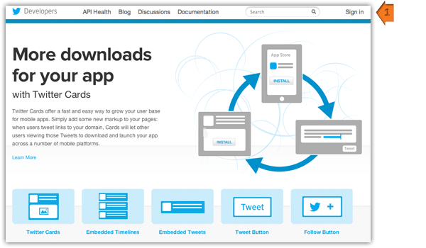
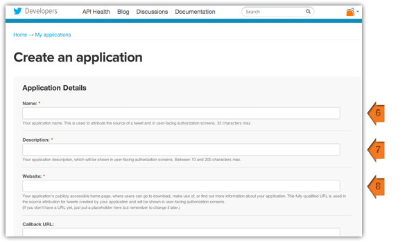
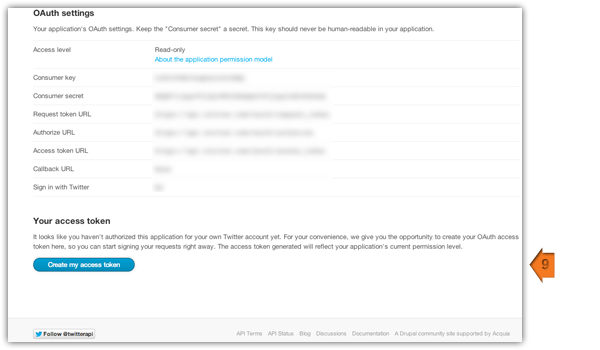
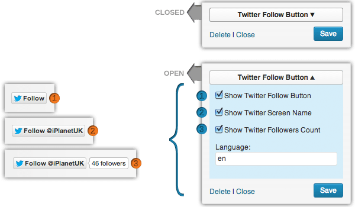

=== Plugin Name ===

Contributors: Planet Interactive
Donate: https://www.paypal.com/cgi-bin/webscr?cmd=_s-xclick&hosted_button_id=A9437VN7R36VN
Tags: Twitter, Stream, Tweets, Twitter OAuth, social
Requires at least: 3.0
Tested up to: 4.3
Stable tag: 4.0
License: GPLv2 or later
License URI: http://www.gnu.org/licenses/gpl-2.0.html

Simple Twitter Tweets - Display your Tweets on your Wordpress site using the new Twitter OAuth API v1.1. (even when you can't connect) Because they're backed up!

== Description ==

A Simple Twitter Tweets display widget, using Twitter OAth and API v1.1 and backup up so it always displays your Tweets.

**Why?**

Our clients, especially on shared hosting were having issues with the Twitter API not displaying their tweets, too many connections from the same source (host). We solved that issue, then lo and behold Twitter changed their API so displaying your own Tweets required OAuth authentication and finally we buckled and decided to roll our own so it would be simple for them, for us and for you.

Twitter changed their API again. Removing version 1.0 of the API altogether and by forcing version 1.1 of the API and use of the OAuth authentication requirement. We wrote this plugin so everyone could have it at a click of a button.

There are a few Twitter plugins out their, but we couldn't find one simple enough, or that worked (to be honest) and so the Simple Twitter Tweets plugin was born.

Twitter users who want to display their Tweets on their website (or within an application) have to create a Twitter Application to get access to the required "Keys" and "Tokens" Twitter provides for Authentication. The instructions for this are provided below so you can be up and running with Tweets on your site in less time than it takes to make a cup of Tea.

= Features =

* Simple setup
* Twitter API v1.1 compliant (OAuth Ready)
* No passwords required or used
* Works even when Twitters down, over capacity or not connecting
* Tweets stored in the database with each call, so if your call to the Twitter API fails for whatever reason there won't be a blank space or Oops message on your site, you'll just see the last set of Tweets the system stored - sweet huh.
* Tweeted when? - In Human Time using minutes, hours and days (i.e. 5 hours ago) or using Twitter time display (i.e. 5h)
* Twitter intents - increase social interaction with users ability to Reply, Retweet and Favourite your tweets right from you page
* Twitter intents using bespoke (only three characters) icon font (tiny) and colour the icons right in the widget
* Did we say it was simple and works...

== Installation ==

Installation is as simple as 1,2,3 or maybe 4 because of Twitter :)

1. Upload 'simple-twitter-tweets' to the '/wp-content/plugins/' directory
2. Activate the plugin through the 'Plugins' menu in WordPress
3. Add the Widget to your page (e.g. Sidebar) and update the required details
4. Click Save
5. Note: You can either use Loklak API or you will need to create a Twitter Application - See below.

= Creating a Twitter Application =

The Twitter Widget will never ask for your password, as it gets all your required data from the Open Authentication keys and secrets you will get by creating your application at Twitter. It also means that if you change your password, you won’t need to update any of the details of your Widget.

To find these details, go to https://apps.twitter.com/ and sign in.

Center of the screen click "Create a New Application."

Enter a unique name (anything you want), a description (again this is just for you), and your site's URL. You can leave the Callback URL empty as it is not used for this implementation.

Yay, success - OK! You will be taken to a new screen, there's one more step then you can copy all the details into correct fields of the Widget and be on your way.

OK, click the "Create my Access Token" button. This is a shortcut to authenticate your own account with your application (so you never need use your password).

Good. Now click the Details Tab as all the information you need is presented hereso you can just copy the required information into the exact corresponding inputs fields of the Widget.

Full details and screenshots of this process can seen on the [Simple Twitter Tweets page](http://www.planet-interactive.co.uk/simple-twitter-tweets "Simple Twitter Tweets page by Planet Interactive")

= The Widget Options =

Fill in your details, copy and past the Twitter Application details (as described below).

* You can select the Title of the Widget as you like.
* Enter your Twitter username (without the @) just the name.
* How many Tweets to display
* The time in minutes between updates (per the API requirement) this should be 5 but if the API changes you can alter it here.
* Consumer Key: Under the *OAuth settings* heading
* Consumer Secret: Under the *OAuth settings* heading
* Access Token: Under the *Your access token* heading
* Access Token Secret: Under the *Your access token* heading
* Choose if you want the @replies included or not
* Avatar: Your image or logo as displayed on Twitter – show on/off
* Avatar: Round the corners to your image (5px on modern browsers)
* Avatar: Set the size - defaults to the Twitter default of 48px
* Time Display: Default is WP human time (i.e. 5 hours ago)
* Time Display: New option – if set, Twitter time (i.e. 5h)
* Time Display: Choose to display the 'ago' or not
* Twitter Intents: Show Twitter intents for 'Reply', 'Retweet' and 'Favourite'
* Twitter Intents: Option to hide the Text and just use icons
* Twitter Intents: Colourise the icons to your display
* Twitter Follow: Choose to Show the Twitter Follow button
* Twitter Follow: Choose to show your Twitter name
* Twitter Follow: Choose to show your follower count
* Twitter Follow: Enforce your language (defaults to en [English])
* Click Save

Enjoy!

== Frequently Asked Questions ==

= Can I change the look and feel of the Tweets =

Of course you can. It's really simple too.

The Tweets are in a widget as with all widgets, and are a simple unordered list.

* To make styling easier the &lt;ul&gt; has a class of Tweets - &lt;ul class="tweets"&gt;
* Each Tweet is a list item &lt;li&gt;
* Each Time reference is an emphasised link &lt;em&gt;&lt;a&gt;
* Inside the &lt;li&gt; we now have (if you choose to diplay it) the avatar image
* Inside the &lt;li&gt; we also have (if you choose to diplay them) the Twitter intents. These are are in a DIV with a class of 'intent-meta' – in case you want to control its placement or spacing further. Each Intent is a link containing a 'span' for icon (using icon fonts for speed and styling flexibility) and another span for the text
* Done.

= Where can I get help =

If you're really stuck use the Wordpress Support Forum or check out the [support portal](http://planetinteractive.freshdesk.com/support/login "Support by Planet Interactive")

= More FAQs =
We've tested it and as far as we know it works great! Phew, but if you have an issue or you want to propose some functionality then submit you ideas at the [support portal](http://planetinteractive.freshdesk.com/support/login "Support by Planet Interactive") and we'll update these FAQs and get onto it when we can.

== Screenshots ==

1. Go to https://apps.twitter.com and Sign In

	

2. Create a new Application

	

3. Fill a name for your App, a description (this is for you) and your website address (URL)

	

4. Click "Create my access token"

	

5. If you've already installed in the "Simple Twitter Tweets" plugin go to Appearance->Widgets (otherwise install it first then go here)

	

6. Drag the "Simple Twitter Tweets" widget your widget area of choice

	

7. Fill in the widget options and correlating Twitter Application OAuth requirements, just copy and paste

	

8. New options for "Twitter Follow Button" and what elements to display

	

9. Style how you like, "Your Tweets your way"

	

== Changelog ==

= 4.0 =
* [Added] Multiple Widget ready - you can now use multiple versions in widget ready areas as requested
* [Added] Internationalisation (i18n) - Ready for impending WP [theme and plugin] Language packs. All interface text marked up ready for translations
* [Fixed] Redeclared Function Error Fixed

= 3.3 =
* [Fixed] PHP deprecated functions (notice) added PHP 5 construction references

= 3.2 =
* [Added] SSL reference for avatar (profile pic) images for secure pages
* [Added] Check for data retrieval, handles foreach warning (bullet proof old bug)
* [Added] Defined 'ago' so when not used handles warning
* [Added] Clean inputs no whitespace issue
* [Updated] URL for Twitter apps creation updated (as it was moved)

= 3.1 =
* [Fixed] Serialization error fixed - changed base_64 fix for 4-byte emoji strip

= 3.0 =
* [Fixed] Class conflict error - check for use before including
* [Fixed] Emoji error (presented as for each error) 4-byte emoji issue
* [Fixed] Word break (letter break on certain browsers) - moved so break on links only to ensure long URLs don't break display

= 2.1 =
* [Updated] Intents was on by default before selected (but not saved) - now off on initialisation and user selection to turn on required
* [Fixed] Show Avatar was maintaining indent of tweets when turned off after having been set. Now checks for Avatar on flag not just size change.

= 2.0 =
* [Added] Twitter Avatar, display, controls, presentation, styling and more
* [Added] Time display formating and options
* [Added] Twitter Intents, plus display styling and options
* [Updated] Time reference i18n (localisation) compliance
* [Updated] Widget UI, cleaner and more compartmentalized
* [Fixed] Twitter API Copy/Paste (copy and past can introduce whitespace error - fixed)
* [Fixed] Widget UI Javascript fix

= 1.3.3 =
* [Fixed] URLs no longer truncated in retweets!
* [Added] cURL error notification: this is a required PHP extension for connection to the Twitter API

= 1.3.2 =
* Fixed Exclude Replies variable notice and tweet calculation

= 1.3.1 =
* Added @ symbol for Twitter name links in Tweets

= 1.3 =
* Added
	* Hash Tag linking and ReTweet @names linking
	* Name reference added to hover state attribute for date link Screen Names - better than username reference

* Updated
	* Updated depricated functions to ensure future compatibility
	* Rewrote link creation for URLs in tweets

* Fixed
	* Fixed screen name reference for Twitter date links

= 1.2 =
* Added Twitter name reference enabling database backup for multiple account use
* Added Twitter Follow Button and configuration options
* Updated screenshots and instructions for new functionality and option settings

= 1.1 =
* Readme, descriptions and screenshot updates

= 1.0 =
* Initial release

== Upgrade Notice ==

= 1.3.3 =

Fixed retweets truncated links and more.