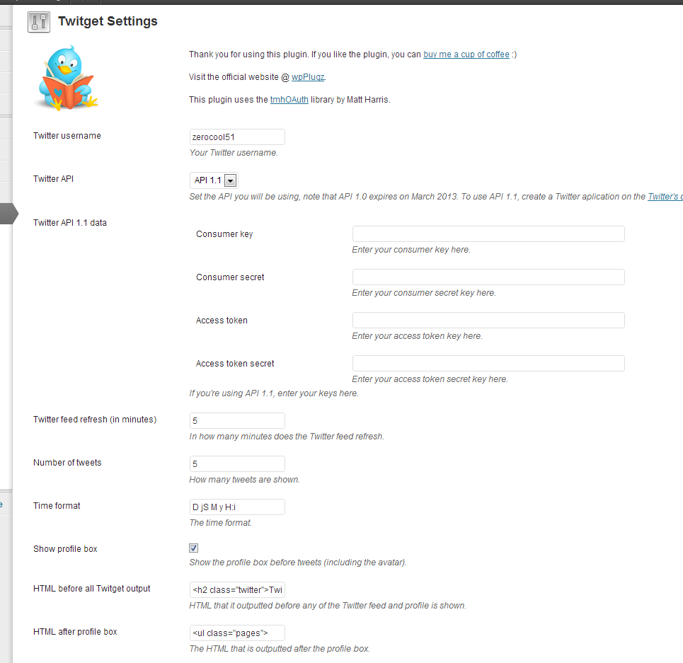

=== Plugin Name ===

Contributors: ZeroCool51
Donate link: https://www.paypal.com/cgi-bin/webscr?cmd=_s-xclick&hosted_button_id=SKMW3BAC8KE52
Tags: twitter widget, twitter, simple twitter widget, custom twitter, widget, tweet, twitter sidebar, twitter 1.1 api
Requires at least: 3.0
Tested up to: 4.3
Stable tag: 3.3.8
License: GPLv2 or later
License URI: http://www.gnu.org/licenses/gpl-2.0.html

A simple widget that shows your recent tweets with fully customizable HTML output and Twitter API 1.1 support.

== Description ==

This is a simple widget that shows your recent tweets. It also supports caching, so you won't exceed the API call limit.

What this plugin offers:

* Show your Twitter feed as a widget
* Customize number of shown tweets
* Customize if you want to show retweets or replies
* Show profile box
* Customize entire HTML output (and use custom variables to customize your feed output)
* Twitter API 1.1 support
* Show Twitter times in clients timezone
* Support for over 30 languages (date output)

== Installation ==

1. Upload the plugin directory to to the '/wp-content/plugins/' directory
2. Activate the plugin through the 'Plugins' menu in WordPress
3. Customize the settings in Settings->Twitget
4. Add the widget to the desired location or use a shortcode [twitget] in your posts

== Frequently Asked Questions ==

None at the moment.

== Screenshots ==

1. Twitter feed (widget in action on first blog)

	

2. Twitter feed (widget in action on second blog)

	

3. Twitget settings page

	

4. Available variables for custom HTML output and example

	

== Changelog ==

= 3.3.8 =
* [Bufix] Typo in method call. Please update immediately.

= 3.3.7 =
* [Bugfix] Replaced deprecated widget call. Please update if using WordPress 4.3 or newer.

= 3.3.6 =
* [Feature] Added option to use HTTPS wherever possible (avatar image URL).

= 3.3.5 =
* [Fix] Updated widget constructor call.

= 3.3.4 =
* [Fix] Small fix in time display.

= 3.3.3 =
* [Fix] Fixed a small XSS security exploit (could only be done if a user had admin access to your blog).
* [Fix] Added nonce checking for form validation.

= 3.3.2 =
* [Fix] Fixed URL parsing for media URLs.
* [Fix] Small array bug fix.

= 3.3.1 =
* [Fix] Fixed a small feed time refresh bug.

= 3.3 =
* [New] Added option to show original URLs instead of shortened ones
* [Fix] Fixed invalid parsing of some URLs in tweets
* [Fix] Fixed warning in date array
* Updated to latest tmhOAuth lib.

= 3.2 =
* [Fix] Language fix for Norwegian
* [New] Added Finnish language.

= 3.1 =
* [Fix] Fixed an encoding bug that caused settings to be wiped out if Twitter feed had "special characters"

= 3.0 =
* [New] Added option to truncate tweets in output
* [New] Added option to show retweet profile image of original tweet
* [New] Added new variables for bigger profile images
* [New] Added language support
* [New] Added the option to choose which PHP API to use for Twitter API calls
* [Fix] Fixed a settings bug
* [Fix] Fixed shortcode, now returns instead of echoes value
* [Fix] Fixed script including
* Deprecated the 1.0 API option, as it is also officially deprecated
* Deprecated browser cookie for timezone
* Deprecated local time variable
* Tweet times are now defaultly shown in clients time with JQuery

= 2.2.2 =
* [Fix] Fixed another jQuery bug (now checking if jQuery is already included so there are no clashes).

= 2.2.1 =
* [Fix] Fixed a jQuery bug (wouldn't load dates if client timezone was selected).

= 2.2 =
* [New] Changed client timezone tweets setting, everything is done on client side now
* [Fix] Fixed a bug that caused settings to be unsaved.

= 2.1.4 =
* [Fix] Fixed a small hash URL bug (wouldn't work if links would open in new window).

= 2.1.3 =
* Replaced deprecated hashtag URL with new value.

= 2.1.2 =
* Added option to open Twitter feed links in new window.

= 2.1.1 =
* [Fix] Fixed a shortcode <? instead of <?php problem.

= 2.1 =
* Added support to show tweet times in clients browser timezone.

= 2.0.1 =
* [Fix] Fixed an update bug, please update your plugin ASAP, because it can slow down performance.

= 2.0 =
* [New] Added new variables: reply, retweet, favorite, tweet link
* [New] Show times in local time
* [Fix] Fixed a bug if multiple plugins were using the same twitter class
* [Deprecated] Removed boxes before, after etc., custom HTML output is now the default value
* [Deprecated] API 1.0 is now deprecated

= 1.3.2 =
* Fixed update procedure, with less hassle
* Added shortcode support in posts.

= 1.3.1 =
* Fixed an installation/update bug that resulted in unupdated values.

= 1.3 =
* Added the option to exclude replies
* Added the option to show relative time of tweets
* Added the option to fully customize html output.

= 1.2.4 =
* [Fix] Sometimes retweets were cut or content was missing.

= 1.2.3 =
* [Fix] Fresh installation bug (missing values)

= 1.2.2 =
* [Fix] Sometimes mentions were wrongly presented (@username? - question mark was present as username)
* [Fix] Sometimes hashes were wrongly presented
* [Fix] Ommited some things in the update process for faster updating.

= 1.2.1 =
* [Fix] At update, some options would not show
* [Fix] Old updates (1.2, 1.1) caused empty values at fresh install or update.

= 1.2 =
* Added the ability to include retweets in your feed.

= 1.1 =
* Added support for Twitter API 1.1.

= 1.0 =
* Initial version.

== Upgrade Notice ==

= 2.0.1 =

Please urgently update, the plugin keeps updating itself because the version variable is not set correctly and it also slows down plugin performance.

= 2.0 =

This upgrade deprecates all previous HTML fields (before, after, suffix, before tweet etc.) and instead uses the provided custom HTML output template.

It also deprecates the use of the Twitter API 1.0, but the settings are still available.

== Creating a Twitter application ==

To use the Twitter 1.1 API you need to create an application. Follow this Youtube tutorial to create it.

[youtube http://www.youtube.com/watch?v=noB3P-K-wb4]

== Custom HTML output ==

You can fully customize your HTML output via variables. Some variables can only be used inside a feed loop, others anywhere. Before you output a Twitter feed, you must write the following:

```
{$tweets_start}
// Your other data here ...
{$tweets_end}
```

Once inside a loop, you can use any of the following variables:

```
{$tweet_text} - the text of the tweet
{$tweet_time} - the time of the tweet
{$tweet_location} - the location of the tweet (example: Budapest)
{$retweet} - outputs a ready retweet link with the text Retweet, opens in new tab
{$reply} - outputs a ready reply link with the text Reply, opens in new tab
{$favorite} - outputs a favorite link with the text Favorite, opens in new tab
{$retweet_link} - returns URL of retweet link
{$reply_link} - returns URL of reply link
{$favorite_link} - returns URL of favorite link
{$tweet_link} - returns URL of tweet
```

Outside a loop or inside a loop you can use the following:

```
{$profile_image} - the url to the profile image of the user
{$user_real_name} - the real name of the user
{$user_twitter_name} - username of the twitter user
{$url} - website url of the user
{$user_description} - description of the user
{$user_location} - user location
{$follower_count} - number of followers
{$friends_count} - number of friends
{$profile_image_normal_url} - return URL of tweet profile image - 48x48 px size (if retweet in loop, returns original tweet profile image)
{$profile_image_bigger_url} - return URL of tweet profile image - 73x73 px size (if retweet in loop, returns original tweet profile image)
{$profile_image_mini_url} - return URL of tweet profile image - 24x24px size (if retweet in loop, returns original tweet profile image)
{$profile_image_original_url} - return URL of tweet profile image - original size (if retweet in loop, returns original tweet profile image)
```

For example if you want to output Twitter text, a retweet link, a custom favorite link and some data behind the feed, you would do the following:

```
<ul>
{$tweets_start}
	<li>{$tweet_text}<br />on {$tweet_time}<br />{$retweet} | <a href="{$favorite_link}">Favorite this tweet</a></li>
{$tweets_end}
</ul>

I have {$follower_count} followers and {$friends_count} friends.
```

And this is basically it.

== Author ==

The author of this plugin is Bostjan Cigan, visit the [homepage](http://bostjan.gets-it.net "homepage").

== Thank you ==

A big thank you goes to all the people that take the time to post a support thread on the forum. It helps this plugin to stay alive and work as
it should.

I would also like to thank to the following Wordpress forum members that have helped me found and eradicated some nasty bugs:

* [Scuddr](http://wordpress.org/support/profile/scuddr "Scuddr")
* [2unco](http://wordpress.org/support/profile/2unco "2unco")
* [tomdxw](http://wordpress.org/support/profile/tomdxw "tomdxw")

== Donators ==

Thank you to the following people who have donated so far:

* Aaron
* Corinne
* Civil Society Trust
* Kay Grant
* JD Kitchens
* Rachel Young

I appreciate your support!
